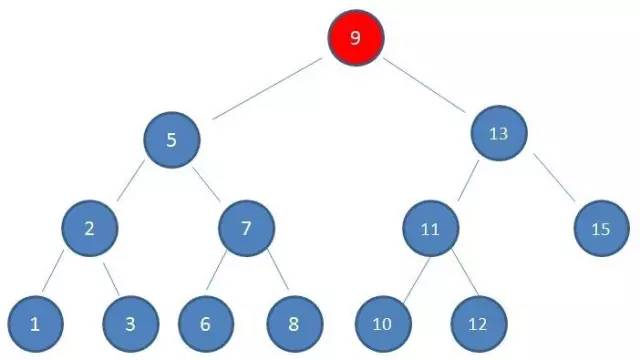
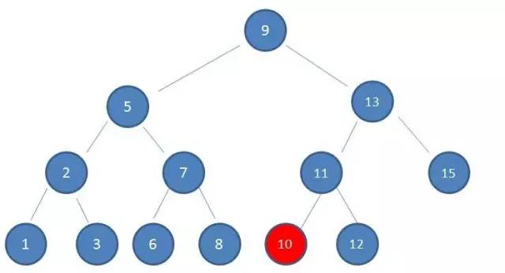

## B-Tree

B-Tree就是我们常说的B树, B树这种数据结构常常用于实现数据库索引，因为它的查找效率比较高

### 为什么要使用B-Tree

二叉查找树查询的时间复杂度是O（logN），查找速度最快和比较次数最少，既然性能已经如此优秀，但为什么实现索引是使用B-Tree而不是二叉查找树，关键因素是磁盘IO的次数。

数据库索引是存储在磁盘上，当表中的数据量比较大时，索引的大小也跟着增长，达到几个G甚至更多。当我们利用索引进行查询的时候，不可能把索引全部加载到内存中，只能逐一加载每个磁盘页，这里的磁盘页就对应索引树的节点。

#### 使用二叉树时磁盘IO次数

定义一个树高为4的二叉树，查找值为10：

第一次磁盘IO:

第二次磁盘IO:

第三次磁盘IO:

第四次磁盘IO:

从二叉树的查找过程了来看，树的高度和磁盘IO的次数都是4，所以最坏的情况下磁盘IO的次数由树的高度来决定。

#### B-Tree

为了减少磁盘IO的次数，需要将原来的二叉树结构变得更加的"矮胖"，这也是B-Tree的特征之一。B-Tree的特征:

1. 根结点至少有两个子女。

2. 每个中间节点都包含k-1个元素和k个孩子，其中 m/2 <= k <= m

3. 每一个叶子节点都包含k-1个元素，其中 m/2 <= k <= m

4. 所有的叶子结点都位于同一层。

5. 每个节点中的元素从小到大排列，节点当中k-1个元素正好是k个孩子包含的元素的值域分划。

将上述二叉树转换为`B-Tree`如下:

##### B-Tree的磁盘IO情况

假如查询的数值是5

第一次磁盘IO:

在内存中与9比较后，进行第二次磁盘IO：

在内存中和(2,6)比较，进行第三次磁盘IO:

可以看出在B-Tree在查询中比较次数并不比二叉树少，但是只要树的高度足够低，IO的次数足够少，就可以提升性能(比较是在内存中进行，耗时几乎可以忽略)

##### B-Tree的使用场景

B-Tree主要用于文件系统以及部分数据库索引，比如非关系数据库MongoDB

### 参考资料
- [B树、B+树、LSM树](https://blog.csdn.net/u010853261/article/details/78217823)