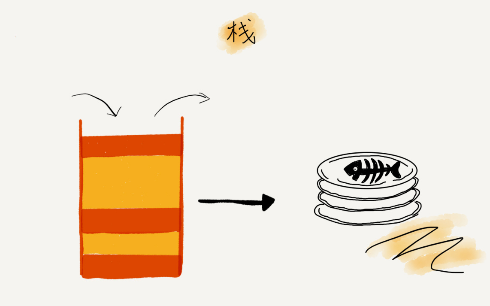
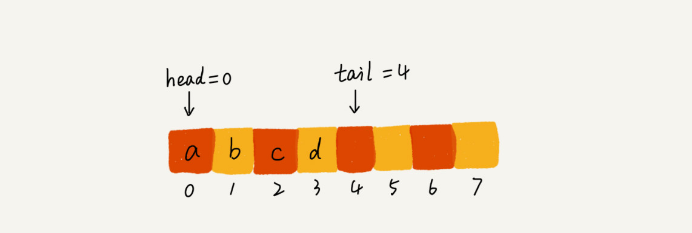

## 栈和队列

### 栈

栈是一个先入后出(FILO)的数据结构, 只允许在一端进行操作：


栈只支持两种操作： 入栈( push )和 出栈( pop )

当某个数据集合只涉及在一端插入和删除数据，并且满足先进先出的特性，应该选择栈

#### 栈的实现

采用数组的方式实现的栈叫顺序栈， 采用链表的方式实现的是链式栈

以下是顺序栈的一个实现：
```java
// 基于数组实现的顺序栈
public class ArrayStack {
  private String[] items;  // 数组
  private int count;       // 栈中元素个数
  private int n;           // 栈的大小

  // 初始化数组，申请一个大小为 n 的数组空间
  public ArrayStack(int n) {
    this.items = new String[n];
    this.n = n;
    this.count = 0;
  }

  // 入栈操作
  public boolean push(String item) {
    // 数组空间不够了，直接返回 false，入栈失败。
    if (count == n) return false;
    // 将 item 放到下标为 count 的位置，并且 count 加一
    items[count] = item;
    ++count;
    return true;
  }
  
  // 出栈操作
  public String pop() {
    // 栈为空，则直接返回 null
    if (count == 0) return null;
    // 返回下标为 count-1 的数组元素，并且栈中元素个数 count 减一
    String tmp = items[count-1];
    --count;
    return tmp;
  }
}

```

### 队列

队列是一种先入先出(FIFO)的数据结构, 同样队列也只支持两种操作: 入队( enqueue )和出队( dequeue )


#### 顺序队列

使用数组实现的队列称为顺序队列， 实现代码如下:
```java
// 用数组实现的队列
public class ArrayQueue {
  // 数组：items，数组大小：n
  private String[] items;
  private int n = 0;
  // head 表示队头下标，tail 表示队尾下标
  private int head = 0;
  private int tail = 0;

  // 申请一个大小为 capacity 的数组
  public ArrayQueue(int capacity) {
    items = new String[capacity];
    n = capacity;
  }

  // 入队
  public boolean enqueue(String item) {
    // 如果 tail == n 表示队列已经满了
    if (tail == n) return false;
    items[tail] = item;
    ++tail;
    return true;
  }

  // 出队
  public String dequeue() {
    // 如果 head == tail 表示队列为空
    if (head == tail) return null;
    // 为了让其他语言的同学看的更加明确，把 -- 操作放到单独一行来写了
    String ret = items[head];
    ++head;
    return ret;
  }
}
```

可以看到，队列需要两个指针： head指针指向队头， tail指针指向队尾。结构如下:


随着入队和出队，不停的后移 head 和 tail 指针。但是当 tail 移动到最后的时候， 即使队列还有空闲空间， 也无法在往队列中添加数据了。我们可以采用 *数据搬移* 来解决这个问题：在入队的时候，如果没有空闲空间了，就触发一次数据搬移，将数据整体搬移到数组前部，改一下入队`enqueue`的实现如下:
```
 // 入队操作，将 item 放入队尾
public boolean enqueue(String item) {
  // tail == n 表示队列末尾没有空间了
  if (tail == n) {
    // tail ==n && head==0，表示整个队列都占满了
    if (head == 0) return false;
    // 数据搬移
    for (int i = head; i < tail; ++i) {
      items[i-head] = items[i];
    }
    // 搬移完之后重新更新 head 和 tail
    tail -= head;
    head = 0;
  }
  
  items[tail] = item;
  ++tail;
  return true;
}
```
可以看到，当 tail 移动到数组最右边的时候，如果新的数据入队，就将 head 和 tail 之间的数据整体搬移到数组左边:


#### 链式队列

链式队列是基于链表的队列实现。同样有 head 和 tail 两个指针， 入队操作只需要 `tail->next = new_node`， 出队操作只需要`head = head->next`， 如图:


#### 循环队列

循环队列是将队列组成一个环，也可以解决之前顺序队列`tail==n`时需要进行数据搬移的问题。循环队列结构如下:


这个队列大小为8，当前head=4，tail=7。这时候如果有一个新元素a入队，放入下标为7的位置，但并不把tail更新为8，而是在环后移一位，到下标为0的位置。再有一个新元素b入队，将b放入下标为0的位置，更新tai到1
，此时队列成为这样:


队列满时，情况如下:


此时tail是3，head是4

如果是顺序队列，队列满的条件是:`tail == n`，队列空的条件是`head == tail`

循环队列中，队列满的条件仍然是`head == tail`, 但是队列满的条件变为了`(tail+1)%n == head`，比如上图 (3+1)%8=4。而且循环队列满的时候tail实际上是没有存储数据的，所以会浪费一个存储空间。


代码实现如下:
```java
public class CircularQueue {
  // 数组：items，数组大小：n
  private String[] items;
  private int n = 0;
  // head 表示队头下标，tail 表示队尾下标
  private int head = 0;
  private int tail = 0;

  // 申请一个大小为 capacity 的数组
  public CircularQueue(int capacity) {
    items = new String[capacity];
    n = capacity;
  }

  // 入队
  public boolean enqueue(String item) {
    // 队列满了
    if ((tail + 1) % n == head) return false;
    items[tail] = item;
    tail = (tail + 1) % n;
    return true;
  }

  // 出队
  public String dequeue() {
    // 如果 head == tail 表示队列为空
    if (head == tail) return null;
    String ret = items[head];
    head = (head + 1) % n;
    return ret;
  }
}
```