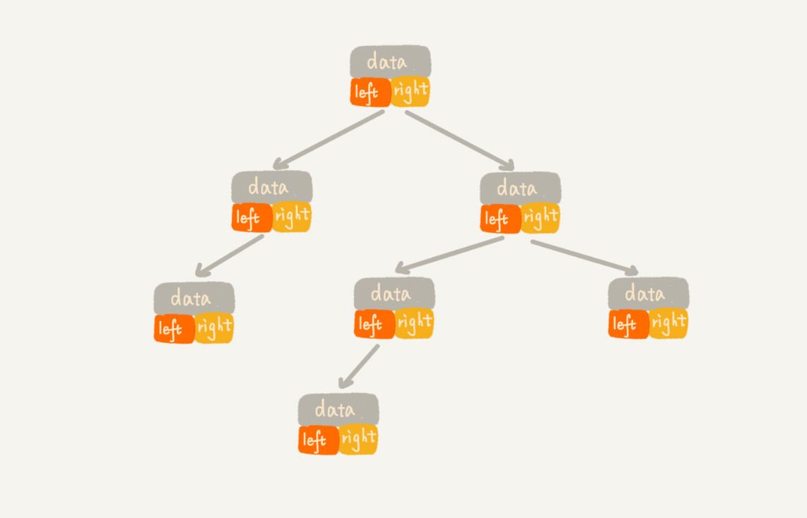

## 树

树的几个定义:


### 二叉树

二叉树是每个节点最多有两个子节点的树。

#### 二叉树的存储结构

二叉树的常用存储结构一般是用链表，每个节点有data和指向左右子节点的指针:


还有一种是顺序存储法，将二叉树存储在数组中。将根节点存储在下标 i=1 的位置，那么左子节点就是 2*i, 右子节点就是 2*i+1：


这样就就可以通过 2*i 和 2*i+1 推算出左右子节点， i/2推算出父节点。但是浪费了一下标为0的空间。而且这是一颗完全二叉树，如果是非完全二叉树，将浪费更多的空间

#### 二叉树的遍历

- 前序遍历(先根)：根->左->右
- 中序遍历(中根)：左->根->右
- 后序遍历(后根): 左->右->跟


递推公式如下:
``` 
前序遍历的递推公式：
preOrder(r) = print r->preOrder(r->left)->preOrder(r->right)

中序遍历的递推公式：
inOrder(r) = inOrder(r->left)->print r->inOrder(r->right)

后序遍历的递推公式：
postOrder(r) = postOrder(r->left)->postOrder(r->right)->print r
```

#### 二叉查找树